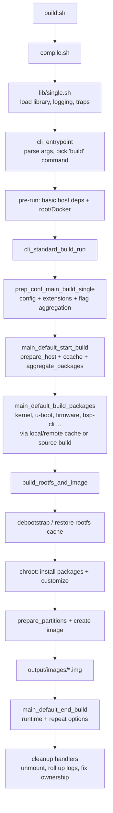

# How `build.sh` Runs — A Walkthrough

This document explains, end to end, what happens when you run the Armbian build
framework with the command stored in [build.sh](../build.sh):

```bash
./compile.sh build BOARD=rpi4b BRANCH=current BUILD_DESKTOP=no BUILD_MINIMAL=yes KERNEL_CONFIGURE=no RELEASE=trixie
```

It is reconstructed from the framework source code and from the real build log
[output/logs/log-build-no-uuidgen-yet-24073-3961.log](../output/logs/log-build-no-uuidgen-yet-24073-3961.log)
(an `rpi4b` / Debian `trixie` / minimal CLI image build that finished in `16:11 min`).

> Note: in this repo `build.sh` is just a thin convenience wrapper — it calls
> `./compile.sh` with the parameters above. `compile.sh` is the real entry point.

---

## 0. What the command means

| Parameter | Value | Meaning |
|---|---|---|
| (command) | `build` | Build a full bootable image (kernel + u-boot + rootfs + image). |
| `BOARD` | `rpi4b` | Target board = Raspberry Pi 4B. |
| `BRANCH` | `current` | Kernel branch family (here resolves to `bcm2711-current`, Linux 6.18). |
| `BUILD_DESKTOP` | `no` | CLI image, no desktop environment. |
| `BUILD_MINIMAL` | `yes` | Minimal package set (drops extras like `armbian-zsh`). |
| `KERNEL_CONFIGURE` | `no` | Do not open the interactive kernel `menuconfig`. |
| `RELEASE` | `trixie` | Userspace = Debian 13 "trixie". |

---

## 1. Entry: `compile.sh`

[compile.sh](../compile.sh) is intentionally tiny. It:

1. Computes `SRC` (the absolute repo path) and refuses to run if the path contains whitespace.
2. Enables strict bash error handling (`set -e`, `errtrace`, `errexit`).
3. Sanity-checks that the framework is fully cloned (`lib/single.sh` must exist).
4. Sources [lib/single.sh](../lib/single.sh), which loads the whole function library.
5. Calls `logging_init` and `traps_init` to set up logging + cleanup traps.
6. Marks `SRC` as a git "safe directory".
7. Hands off everything to `cli_entrypoint "$@"`.

The build's last log line (`Armbian build script exiting … very last thing`) is
also printed from here once `cli_entrypoint` returns.

---

## 2. CLI entrypoint & command dispatch

`cli_entrypoint()` lives in
[lib/functions/cli/entrypoint.sh](../lib/functions/cli/entrypoint.sh). It is the
heart of argument parsing and dispatch:

1. **Register commands** — `armbian_register_commands` builds a map of command
   names (`build`, `docker`, `kernel`, `rootfs`, …) to their handlers.
2. **Parse the command line** — `parse_cmdline_params` splits the arguments into:
   - parameters of the form `KEY=VALUE` → `ARMBIAN_PARSED_CMDLINE_PARAMS`
     (e.g. `BOARD=rpi4b`, `RELEASE=trixie`, …)
   - non-parameter words → `ARMBIAN_NON_PARAM_ARGS` (here just `build`).
3. **Apply params to env (early)** — so config files later can see them.
4. **Re-init logging** now that the params are known.
5. **Resolve the command** — `build` is recognized; its handler is selected.
6. **Pre-run loop** — each command may rewrite itself. For `build` this runs
   `cli_standard_build_pre_run` (see below). This is the *last* moment Docker
   relaunch can happen.
7. **Create output dirs & the build UUID** — `DEST=output/`, `USERPATCHES_PATH=userpatches/`.
   A unique `ARMBIAN_BUILD_UUID` is generated. In this log `uuidgen` was not yet
   installed, so a fallback id `no-uuidgen-yet-24073-3961` was used — which is
   exactly why the log file is named that way.
8. **Define per-build temp dirs** — all under `.tmp/`:
   - `WORKDIR` (`work-<uuid>`) — general scratch, exported as `TMPDIR`.
   - `LOGDIR` (`logs-<uuid>`) — per-section logs (rolled into `output/logs` at the end).
   - `SDCARD` (`rootfs-<uuid>`) — the rootfs is assembled here.
   - `MOUNT` (`mount-<uuid>`) — the final image is mounted here via loop device.
   - `DESTIMG` (`image-<uuid>`) — where the raw image file is staged.
9. **Install basic host deps** — because the `build` command set
   `ARMBIAN_COMMAND_REQUIRE_BASIC_DEPS=yes`, `prepare_host_basic` runs.
   → log section `prepare_host_basic`: `apt-get update` + install of
   `dialog uuid-runtime gawk` on the host.
10. **Source user config files** (if any) from `ARMBIAN_CONFIG_FILES`, re-applying
    cmdline params after each so the command line always wins.
11. **Run the command** — `armbian_cli_run_command` → `cli_standard_build_run`.
12. **Cleanup** — run all registered cleanup handlers (unmount, roll up logs, fix
    output ownership).

### The `build` command pre-run

`cli_standard_build_pre_run` in
[lib/functions/cli/cli-build.sh](../lib/functions/cli/cli-build.sh):

- Requires the basic-deps step (step 9 above).
- Calls `cli_standard_relaunch_docker_or_sudo` — "give me root on Linux".
  In this run Docker was disabled (`PREFER_DOCKER=no`) and the process was
  already relaunched as root (`ARMBIAN_RELAUNCHED=yes`, `SET_OWNER_TO_UID=1000`),
  which is visible in the log header `ARGs:` line.

---

## 3. The build command run

`cli_standard_build_run` (same file) does two things:

```bash
prep_conf_main_build_single                               # configuration
do_with_default_build full_build_packages_rootfs_and_image # the actual build
```

It also sets the markers `BUILDING_IMAGE=yes` and `NEEDS_BINFMT=yes` (QEMU binfmt
is needed because we build an `arm64` image, possibly on a different host arch).

---

## 4. Configuration phase — `prep_conf_main_build_single`

Defined in
[lib/functions/main/config-prepare.sh](../lib/functions/main/config-prepare.sh).
Each step below is its own log section:

| Log section | Function | What it does |
|---|---|---|
| `config_early_init` | `config_early_init` | Checks host OS (`trixie`/`arm64`), enumerates all available boards. |
| `config_source_board_file` | `config_source_board_file` | Finds and sources `config/boards/rpi4b.*` (sets `BOARD_TYPE`). |
| (inline) | `config_possibly_interactive_*` | Resolve BRANCH / RELEASE / DESKTOP / MINIMAL. Non-interactive here because all are on the command line. |
| `do_main_configuration` | `do_main_configuration` | Big one: sets architecture, family (`bcm2711`), kernel source, u-boot config; **initializes the extension manager** and fires the `extension_prepare_config` hook. |
| `do_extra_configuration` | `do_extra_configuration` | Applies board/family overrides and extension config. |
| `config_post_main` | `config_post_main` | Computes the `CHOSEN_*` package names and finalizes kernel settings. |

After config it calls `mark_aggregation_required_in_default_build_start` — package
aggregation cannot run yet (host isn't fully prepared), so it is just *flagged*
to run later. The phase ends with
`Configuration prepared for BOARD build  rpi4b.<type>`.

---

## 5. `do_with_default_build` — start / body / end

[lib/functions/main/default-build.sh](../lib/functions/main/default-build.sh)
wraps the real work between a start and an end:

```bash
main_default_start_build      # prepare host, ccache, run aggregation
full_build_packages_rootfs_and_image
main_default_end_build        # runtime + repeat-options
```

### 5a. `main_default_start_build` (host prep + aggregation)

From [lib/functions/main/start-end.sh](../lib/functions/main/start-end.sh):

1. Prints **Repeat Build Options (early)** so you can re-run the build.
2. `prepare_host_init`:
   - records the start timestamp,
   - `wait_for_disk_sync`,
   - `check_dir_for_mount_options` on `.tmp` (log section `check_dir_for_mount_options`),
   - sets up `WORKDIR` as a tmpfs and exports `TMPDIR`/`CCACHE_TEMPDIR`/`XDG_RUNTIME_DIR`,
   - runs `prepare_host` — full host dependency install / directory setup
     (log section `prepare_host_noninteractive`),
   - creates a `python` symlink in `WORKDIR/bin` and prepends it to `PATH`.
3. `prepare_compilation_vars` — ccache / thread (`-j12`) setup.
4. **Package aggregation** (flagged in step 4) now runs →
   log section `aggregate_packages`. This merges all the package lists
   (`config/cli/...`, board, family, desktop, extensions) into the final
   `AGGREGATED_PACKAGES_DEBOOTSTRAP` / `AGGREGATED_PACKAGES_ROOTFS` sets — the
   same data summarized at the top of
   [the summary file](../output/logs/summary-build-no-uuidgen-yet-24073-3961.md).

### 5b. `full_build_packages_rootfs_and_image`

This guards against deprecated flags (`KERNEL_CONFIGURE`, `UBOOT_CONFIGURE`,
`CREATE_PATCHES`), then runs the two big halves:

```bash
main_default_build_packages   # build all .deb artifacts
build_rootfs_and_image        # assemble rootfs, then the image
```

---

## 6. Building the package artifacts — `main_default_build_packages`

From [lib/functions/main/build-packages.sh](../lib/functions/main/build-packages.sh).

`determine_artifacts_to_build_for_image` produces the list of artifacts based on
the configuration. For this build:

- `uboot` (BOOTCONFIG set)
- `kernel`
- `firmware` (Armbian firmware)
- `armbian-base-files`
- `armbian-bsp-cli` (board-specific support package)

(`armbian-zsh` is skipped because `BUILD_MINIMAL=yes`; no desktop/plymouth
artifacts because `BUILD_DESKTOP=no`.)

For **each** artifact the framework runs `build_artifact_for_image`, which uses a
three-tier cache strategy:

1. `artifact_prepare_version` — compute a deterministic hash-version
   (log section `artifact_prepare_version`).
2. `artifact_is_available_in_remote_cache` — check `ghcr.io/armbian/...` for a
   prebuilt `.deb` (log section of the same name).
3. If not cached anywhere → **build it from source**, then pack into the local
   cache (`pack_artifact_to_local_cache`).

### The kernel (the long part of the log)

The kernel is what dominates the 16-minute runtime. Its sub-sections in order:

| Log section | Meaning |
|---|---|
| `kernel_prepare_bare_repo_from_oras_gitball` | Pull the shared kernel git tree (`ghcr.io/armbian/shallow/kernel-git`), create a worktree, fetch `rpi-6.18.y` from `github.com/raspberrypi/linux`. |
| `kernel_drivers_create_patches` | Generate driver patches (wifi injection, brought-back headers, etc.). |
| `kernel_main_patching_python` | Apply the kernel patch series (Python patching engine). |
| `kernel_determine_toolchain` | Pick the cross toolchain (`aarch64-linux-gnu-`). |
| `kernel_config_initialize` / `kernel_config_finalize` | Prepare `.config` from `config/kernel/linux-bcm2711-current.config` (no `menuconfig` since `KERNEL_CONFIGURE=no`). |
| `kernel_build` | The actual `make -j12 ARCH=arm64 … all Image` compile (with ccache). This is the bulk of the log, ~24 000 lines. |
| `kernel_package` | Package the result into `linux-image-…` / `linux-dtb-…` `.deb` files (version `6.18.34-Sac20-…`). |

The other artifacts (`armbian-bsp-cli`, base-files, firmware, u-boot) follow the
same prepare-version → check-cache → build/obtain → reversion-for-deployment
pattern, but are much smaller (visible near log lines 25800–26150).

---

## 7. Building the rootfs and image — `build_rootfs_and_image`

From [lib/functions/main/rootfs-image.sh](../lib/functions/main/rootfs-image.sh).
This is the "debootstrap-ng" stage. The work happens inside `SDCARD` and the
image is later built in `MOUNT`.

### 7a. Get a base rootfs

`get_or_create_rootfs_cache_chroot_sdcard` either restores a cached rootfs or
runs `debootstrap` to create a fresh Debian `trixie` base, using the
`AGGREGATED_PACKAGES_DEBOOTSTRAP` set. The artifact cache flow re-appears
(`extract_rootfs_artifact`, `unpack_artifact_from_local_cache`).

### 7b. Customize inside chroot

| Log section | Function | Meaning |
|---|---|---|
| `mount_chroot_sdcard` | `mount_chroot` | Bind-mount `/dev`,`/proc`,`/sys` into `SDCARD`; QEMU binary deployed for arm64 chroot. |
| `install_distribution_specific_trixie` | `install_distribution_specific` | trixie-specific tweaks. |
| `install_distribution_agnostic` | `install_distribution_agnostic` | Install the `AGGREGATED_PACKAGES_ROOTFS` set + Armbian packages (`apt update` inside chroot). |
| `customize_image` | `customize_image` | Runs user `customize-image.sh` hooks (Armbian repo *not* yet enabled). |
| `post_repo_apt_update` | `post_repo_apt_update` | Enable the Armbian apt repo and update. |
| `post_armbian_repo_customize_image` | hooks | Customizations that need the Armbian repo. |
| `apt_purge_unneeded_packages_and_clean_apt_caches` | — | Remove leftovers, clean apt caches. |
| `apt_lists_copy_from_host_to_image_and_update` | — | Ship a valid `/var/lib/apt/lists` in the image. |
| `list_installed_packages` | `list_installed_packages` | Record the installed package list as a log asset and sanity-check installed hash-versions. |
| `post_debootstrap_tweaks` | `post_debootstrap_tweaks` | Final filesystem tweaks before unmount. |
| `umount_chroot_sdcard` | `umount_chroot` | Unmount the chroot; QEMU binary removed. |

At this point the actual rootfs size is measured (here `898 MiB`).

### 7c. Turn the rootfs into an image

| Log section | Function | Meaning |
|---|---|---|
| `prepare_partitions` | `prepare_partitions` | Create a sparse `.raw` file (1840 MiB), partition it (512 MiB FAT32 `/boot/firmware` + ext4 root), `mkfs`, attach a loop device, mount under `MOUNT`. |
| `create_image_from_sdcard_rootfs` | `create_image_from_sdcard_rootfs` | `rsync` the rootfs (and `/boot`) into the mounted image, run `update-initramfs`, unmount, free the loop device, rename the `.raw` to the final image name, compress, compute SHA256, and **move it to `output/images/`**. |

Final artifact produced in this run:

```
output/images/Armbian-unofficial_26.05.0-trunk_Rpi4b_trixie_current_6.18.34_minimal.img
                                                                    (+ .img.sha and .img.txt)
```

---

## 8. End of build & cleanup — `main_default_end_build`

Back in [start-end.sh](../lib/functions/main/start-end.sh):

- Fires the `run_after_build` extension hook (only when no errors occurred).
- Computes and prints the total **Runtime** (log section `runtime_total` →
  `16:11 min`).
- Prints **Repeat Build Options** (log section `repeat_build_options`) — the exact
  command to reproduce the build, matching the original input.

Finally, control returns up to `cli_entrypoint`, which runs the cleanup handlers
(unmount anything left, roll the per-section logs from `LOGDIR` into
`output/logs/`, restore output ownership to UID 1000), and `compile.sh` prints
its final exit line.

---

## 9. End-to-end flow at a glance



---

## 10. Where things live

| Concern | Location |
|---|---|
| Wrapper / entry | [build.sh](../build.sh), [compile.sh](../compile.sh) |
| Library bootstrap | [lib/single.sh](../lib/single.sh), [lib/library-functions.sh](../lib/library-functions.sh) |
| CLI parsing & dispatch | [lib/functions/cli/entrypoint.sh](../lib/functions/cli/entrypoint.sh), [lib/functions/cli/cli-build.sh](../lib/functions/cli/cli-build.sh) |
| Configuration | [lib/functions/main/config-prepare.sh](../lib/functions/main/config-prepare.sh) |
| Build orchestration | [lib/functions/main/default-build.sh](../lib/functions/main/default-build.sh), [lib/functions/main/start-end.sh](../lib/functions/main/start-end.sh) |
| Artifact/package build | [lib/functions/main/build-packages.sh](../lib/functions/main/build-packages.sh) |
| Rootfs & image | [lib/functions/main/rootfs-image.sh](../lib/functions/main/rootfs-image.sh) |
| Per-section logs | `output/logs/` (e.g. the `### *.log` markers in the build log) |
| Output image | `output/images/` |
| Scratch / per-build temp | `.tmp/{work,logs,rootfs,mount,image}-<uuid>` |
| Caches | `cache/` (`git-bare`, `git-bundles`, `rootfs`, `aptcache`, `initrd`, …) |
```
